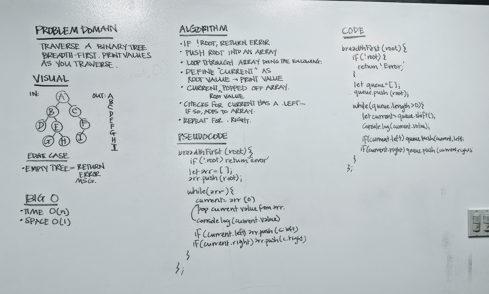

# Code Challenge 17
### Breadth-First Traversal

## Challenge
Write a breadth first traversal method which takes a Binary Tree as its unique input. Without utilizing any of the built-in methods available to your language, traverse the input tree using a Breadth-first approach; print every visited node’s value.

## Approach
* Method pushes the queue into an array
* Loops through the array and removes an item every time. The node that gets removed gets printed. 
* Checks to see if there is a child to the left - if so, that gets pushed to the array.
* Checks to see if there is a child to the right - if so, that gets pushed to the array.
* Repeats until there are no longer any items left in queue.

## Solution

## Tests
* `npm test`
* Should successfully traverse binary tree breadth-first (expected outcome)
* Should return if root is empty.

## Big O
* Time - O(n)
* Space - O(1)
