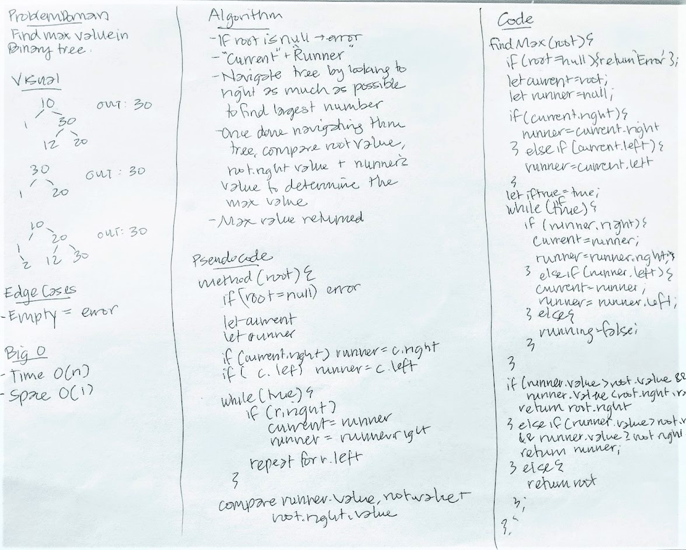

# Code Challenge 17
### Find Max Value in a Binary Tree

## Challenge
* Write a function called find-maximum-value which takes binary tree as its only input. 
* Without utilizing any of the built-in methods available to your language, return the maximum value stored in the tree. 
* You can assume that the values stored in the Binary Tree will be numeric.

## Approach
* If root === null, then return with error.
* Two variables: current and runner. 
* Navigate tree by looking to the right as much as possible to find the largest number.
* Once done navigating through the tree, compare the root value, root.right value, and the runner's value to determine which is largest -- the leaf with the largest value will be returned.

## Solution

## Tests
* `npm test`
* Should return max value in tree (expected, happy outcome)
* Should return max value when root is the max value
* Should return max value when root.right is max value
* Should return error when given an empty tree

## Big O
* Time - O(n)
* Space - O(1)
