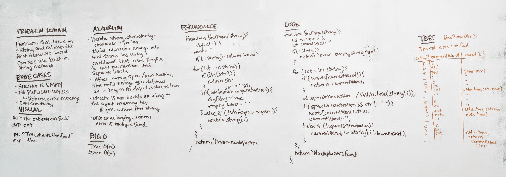

# Code Challenge 26
### Find duplicate value in a string

## Challenge
* Write a function that takes in a string and returns the first repeated word in the string.
* Not allowed to use any built in array methods.

## Approach
- Function that takes in a string
- Two variables: object and string (temporary)
- If string is empty, return Error
- Iterate through each character of the string. 
- Using regex, if it is a letter or number, add to the temporary string
- Using regex, if it is a whitespace or punctuation character, put in object with key as the word, and value as true.
- As strings become defined, check to see if it exists in the object - if yes, returns that string.

## Solution

## Tests
* `npm test`
* Should return first duplicate value, even in instances where it is touching one or several punctuation characters
* Should return error messages when:
  * string input is empty
  * there are no duplicate words in the string

## Big O
* Time - O(n)
* Space - O(n)
