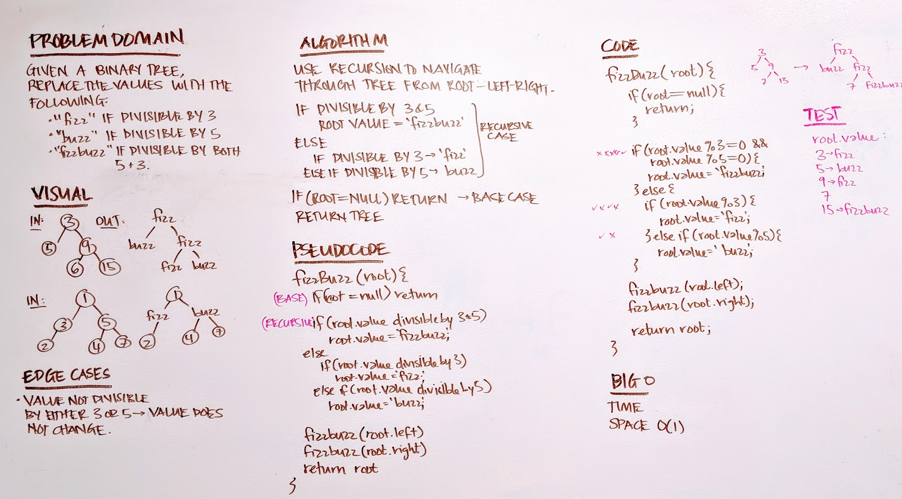

# Code Challenge 16
### Fizzbuzz Tree

## Challenge
* Write a function called `FizzBuzzTree` which takes a tree as an argument.
* Without utilizing any of the built-in methods available to your language, determine weather or not the value of each node is divisible by 3, 5 or both, and change the value of each of the nodes:
  * If the value is divisible by 3, replace the value with “Fizz”
  * If the value is divisible by 5, replace the value with “Buzz”
  * If the value is divisible by 3 and 5, replace the value with “FizzBuzz”
* Return the tree with its new values.

## Approach
* Function to use recursion to navigate through the tree
* If divisible by 3 & 5, reassign value to 'fizzbuzz'
* Else:
  * if divisible by 3, reassign value to 'fizz'
  * else if divisible by 5, reassign value to 'buzz'
* Recursive case calls root.left and then root.right
* When finished, it returns the tree with its new values.

## Solution

## Tests
* `npm test`
* Should return 'fizz' if divisible by 3
* Should return 'buzz' if divisible by 5
* Should return 'fizzbuzz' if divisible by both 3 and 5
* Should remain the same if not divisible by either 3 or 5.

## Big O
* Time - O(log n)
* Space - O(1)
