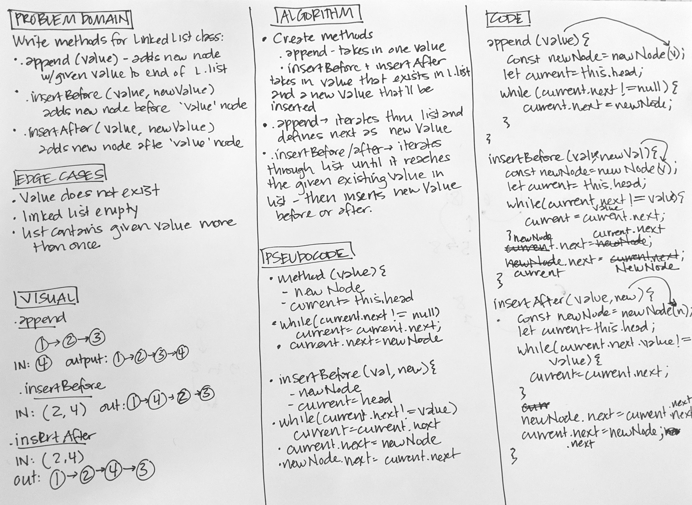

# Code Challenge 06
### Linked List Insertions

## Challenge
* `insertBefore(value, newValue)` which add a new node with the given `newValue` immediately before the first value node
* `insertAfter(value, newValue)` which add a new node with the given `newValue` immediately after the first value node

## Approach
* `append` - iterate through linked list and defines next as new value.
* `insertBefore` - iterate through linked list until the next value is the given value. Assign `newNode.next` as `current.next` and then assign `current.next` as `newNode` value.
* `insertAfter` - iterate through linked list until next value is the given value. Assign `newNode.next` as `current.next.next` and `current.next.next` as the `newNode` value.

## Whiteboard

## Tests
* Can successfully add a node to the end of the linked list
* Can successfully add multiple nodes to the end of a linked list
* Can successfully insert a node before a node located i the middle of a linked list
* Can successfully insert a node before the first node of a linked list
* Can successfully insert after a node in the middle of the linked list
* Can successfully insert a node after the last node of the linked list

## Big O
* Time - 
* Space - 