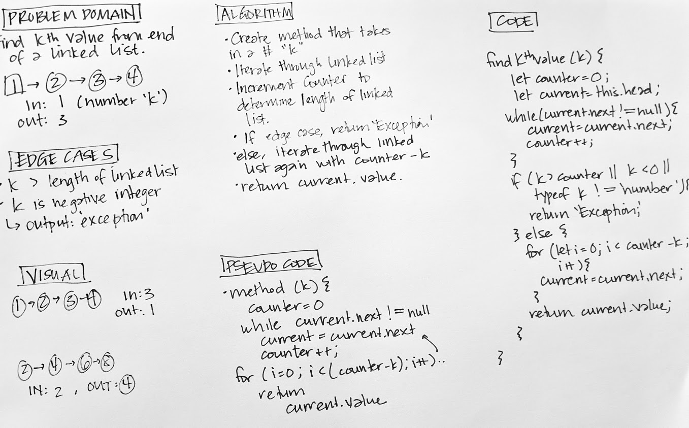

# Code Challenge 07
### Linked List Kth Value

## Feature Tasks
* Find kth value from the **end** of a linked list.

## Whiteboard
;

## Tests
* Can successfully find the kth value of a linked list.
* Returns 'Exception' if k = a negative integer.
* Returns 'Exception' if k is not a number.
* Returns 'Exception' if k > length of linked list.

## Big O
* Time - O(2n)
* Space - O(1)
