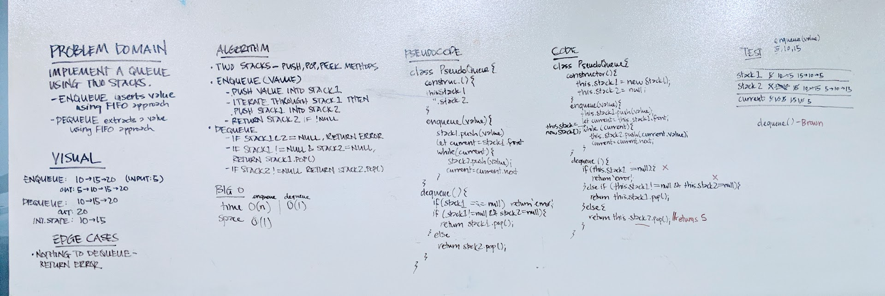

# Code Challenge 11
### Queue with Stacks

## Challenge
* Create a brand new `PseudoQueue` class. Do not use an existing Queue. Instead, this PseudoQueue class will implement our standard queue interface (the two methods listed below), but will internally only utilize 2 Stack objects. Ensure that you create your class with the following methods:
  * `enqueue(value)` which inserts value into the PseudoQueue, using a first-in, first-out approach.
  * `dequeue` which extracts a value from the PseudoQueue, using a first-in, first-out approach.

## Approach
* Creates a class with a constructor that has two stacks - stack1 and stack2
* Stack1 and Stack2 are `Stack` objects that contain a `front` property and can be traversed like nodes
* `enqueue(value)`
  * Uses Stack .push(value) and pushes to stack1
  * Traverses stack1 and pushes the value to stack2 in order to reverse the order
* `dequeue`
  * If both stack1 and stack2 are null, returns an error
  * If stack1 is not null, but stack2 is null, then returns value of `stack1.pop()`
  * If stack2 is not null, then returns value of `stack2.pop()`

## Solution

## Tests
* `npm test`
* Can successfully enqueue 
* Can successfully dequeue

## Big O
* Time - O(n) for enqueue and O(1) for dequeue
* Space - O(1)
